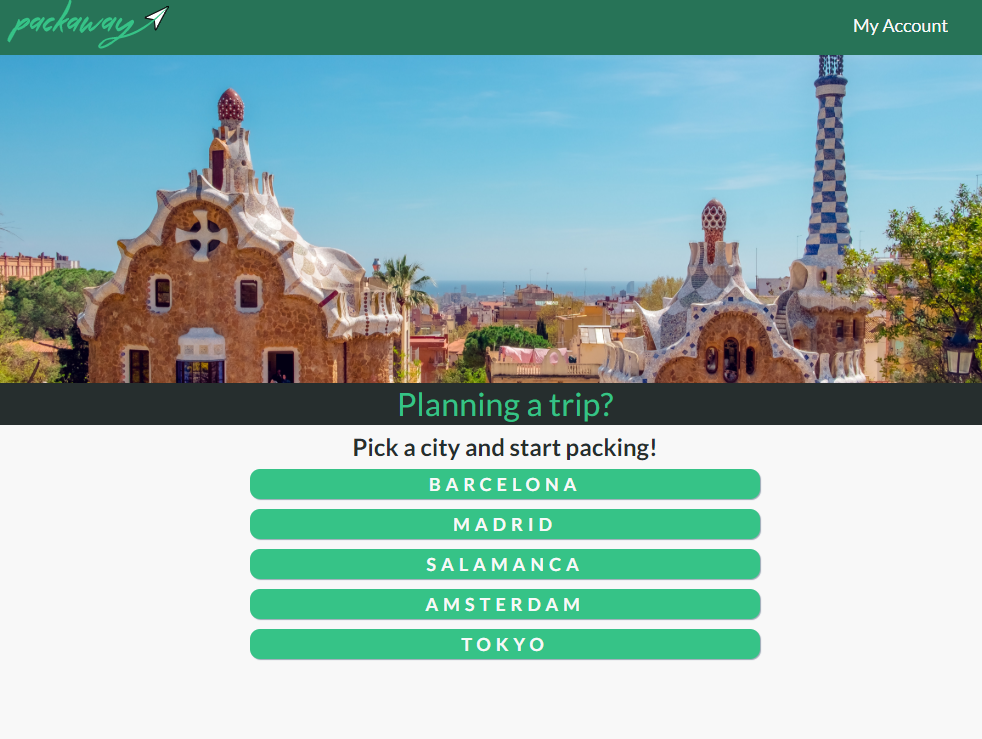

# Packaway
### Final project for Skylab Coders Academy

## The idea behind the app

Travelling has always been one of my passions. Perhaps that’s what has driven me to study languages and other cultures since I was a kid, and why I keep at it nowadays. 

In order to make the most out of each journey, I tend to take my time carefully planning each new trip by checking out what to see and do in my destination city, while also taking into account distances and average time to get there. It’s not easy to choose and plan, and the research behind it all can be quite time-consuming. 

Which is why I thought that it would be a good idea to work on a project that would simplify the whole process. With packaway we can check out the most relevant points of interest in the city and choose the ones we are interested in visiting. It also helps us organize our holiday depending on how many days we have and arrange our selected sights among them. 

I hope that this way we can focus on actually enjoying the trip by easing a bit the pain of planning it. 

Live demo: https://packaway-72184.firebaseapp.com/

## Data and API integration

Data for points of interest is taken from Google's **Places API** and images from **Place Photos**.

I used **react-google-maps-api** for map integration, which in turn uses **Google Maps Javascript API** to embed the map in the website and **Directions API** to generate the route between the selected points of interest. I'm also using AutoComplete from the **Places API** in order to set the origin and destination of the routes.

## Functional Description

### Diagram

## Technical Description

- React JS
- React Router
- Redux
- SASS + React Transition Group
- Firebase
- [React Google Maps API](https://github.com/JustFly1984/react-google-maps-api/tree/master/packages/react-google-maps-api)

## Pages and components

- Home Page
  - Nav Bar
  - Dropdown
- Login Page
  - Sign Up
  - Login
- POI Search Page
  - Category Panel
  - Search Panel
  - POI Item
  - Pack Cart
  - Pack Cart Item
- Profile Page
  - User Details
- Edit Pack Page
  - Info Panel
  - My POI List
  - Day Panel
  - Day Item
- Pack Overview Page
  - Pack Item
- View Pack Page
  - Map Container
  - Directions Item
  - Hotel Search Box